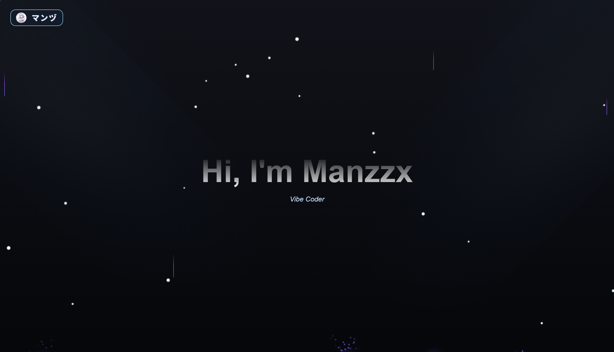

# ✨ Modern Portfolio Website v3

A stunning, responsive portfolio website built with Next.js 15, featuring a beautiful winter theme, modern UI components, and professional architecture.



## 🚀 Features

- **Modern Design**: Clean and professional interface with a winter theme
- **Responsive**: Perfectly optimized for all devices (mobile, tablet, desktop)
- **Interactive UI**: Smooth animations and transitions using Framer Motion
- **Performance**: Built with Next.js 15 App Router for optimal performance
- **Type-Safe**: Full TypeScript support with strict mode
- **Scalable Architecture**: Feature-based structure with centralized configuration
- **Error Handling**: Comprehensive error boundaries and loading states
- **SEO Friendly**: Optimized for search engines with proper meta tags

## 📦 Tech Stack

- **Framework**: [Next.js 15](https://nextjs.org/) (App Router)
- **Language**: [TypeScript 5](https://www.typescriptlang.org/)
- **Styling**: [Tailwind CSS 4](https://tailwindcss.com/)
- **Animations**: [Framer Motion 12](https://www.framer.com/motion/)
- **Icons**: [React Icons](https://react-icons.github.io/react-icons/)
- **Fonts**: Geist Sans & Geist Mono

## 🏗️ Project Structure

```
portfolio.v3/
├── app/                          # Next.js App Router
│   ├── components/              # React components
│   │   ├── projects/           # Project-related components
│   │   │   ├── ProjectCard.tsx
│   │   │   ├── ProjectModal.tsx
│   │   │   ├── DemoModal.tsx
│   │   │   └── index.ts        # Barrel export
│   │   ├── ui/                 # UI components (Aceternity)
│   │   ├── Navbar.tsx
│   │   ├── AboutSection.tsx
│   │   └── ...
│   ├── projects/               # Projects page
│   ├── stats/                  # Stats page
│   ├── social/                 # Social page
│   ├── error.tsx               # Error boundary
│   ├── loading.tsx             # Loading state
│   ├── not-found.tsx           # 404 page
│   ├── layout.tsx              # Root layout
│   └── page.tsx                # Homepage
├── lib/                         # Shared utilities
│   ├── config/                 # Centralized configuration
│   │   ├── app.config.ts       # App metadata & navigation
│   │   ├── theme.config.ts     # Colors & styling
│   │   └── tech-icons.config.ts # Technology icons
│   ├── data/                   # Data layer
│   │   └── projects.data.ts    # Projects data
│   ├── services/               # Business logic
│   │   └── project.service.ts  # Project operations
│   ├── types/                  # TypeScript types
│   │   └── project.types.ts
│   └── utils.ts                # Utility functions
├── public/                      # Static assets
├── .env.example                # Environment variables template
├── .gitignore
├── next.config.ts
├── tailwind.config.ts
├── tsconfig.json
└── package.json
```

## 🚀 Getting Started

### Prerequisites

- Node.js 18+ and npm/yarn/pnpm
- Git

### Installation

1. **Clone the repository**
   ```bash
   git clone https://github.com/Manzzzx/portfolio.v3.git
   cd portfolio.v3
   ```

2. **Install dependencies**
   ```bash
   npm install
   # or
   yarn install
   # or
   pnpm install
   ```

3. **Setup environment variables**
   ```bash
   cp .env.example .env
   ```
   
   Edit `.env` and fill in your values:
   ```env
   NEXT_PUBLIC_SITE_URL=http://localhost:3000
   NEXT_PUBLIC_GITHUB_USERNAME=your_github_username
   NEXT_PUBLIC_INSTAGRAM_USERNAME=your_instagram_username
   ```

4. **Run the development server**
   ```bash
   npm run dev
   ```

5. **Open [http://localhost:3000](http://localhost:3000) in your browser**


## ⚙️ Configuration

### App Configuration (`lib/config/app.config.ts`)

Update site metadata, navigation, and social links:

```typescript
export const APP_CONFIG = {
  site: {
    title: "Your Name",
    description: "Your Description",
    url: "https://yoursite.com",
  },
  social: {
    github: {
      url: "https://github.com/yourusername",
      username: "yourusername",
    },
    // ...
  },
};
```

### Theme Configuration (`lib/config/theme.config.ts`)

Customize colors and styling:

```typescript
export const THEME_CONFIG = {
  colors: {
    primary: "#8DD8FF",
    secondary: "#5ab7d8",
    // ...
  },
};
```

## 🎨 Customization

### Changing Colors

Edit `lib/config/theme.config.ts` to change the color scheme.

### Adding New Pages

1. Create a new folder in `app/` (e.g., `app/blog/`)
2. Add `page.tsx` in that folder
3. Update navigation in `lib/config/app.config.ts`

### Modifying Components

Components are organized by feature:
- Shared components: `app/components/`
- Feature-specific: `app/components/[feature]/`

## 🚢 Deployment

### Vercel (Recommended)

1. Push your code to GitHub
2. Import project in [Vercel](https://vercel.com)
3. Add environment variables
4. Deploy!

### Other Platforms

```bash
# Build for production
npm run build

# Start production server
npm start
```

## 📚 Documentation

- [Architecture Documentation](./ARCHITECTURE.md) - Detailed architecture guide
- [Next.js Documentation](https://nextjs.org/docs)
- [Tailwind CSS Documentation](https://tailwindcss.com/docs)
- [Framer Motion Documentation](https://www.framer.com/motion/)

## 🤝 Contributing

Contributions are welcome! Feel free to:
- Report bugs
- Suggest features
- Submit pull requests

## 🙏 Acknowledgments

- UI Components inspired by [Aceternity UI](https://ui.aceternity.com/)
- Icons from [React Icons](https://react-icons.github.io/react-icons/)
- Fonts from [Vercel](https://vercel.com/font)

---

⭐ Star this repository if you find it helpful!

**Built with ❤️ by [マンヅ](https://github.com/Manzzzx)**
